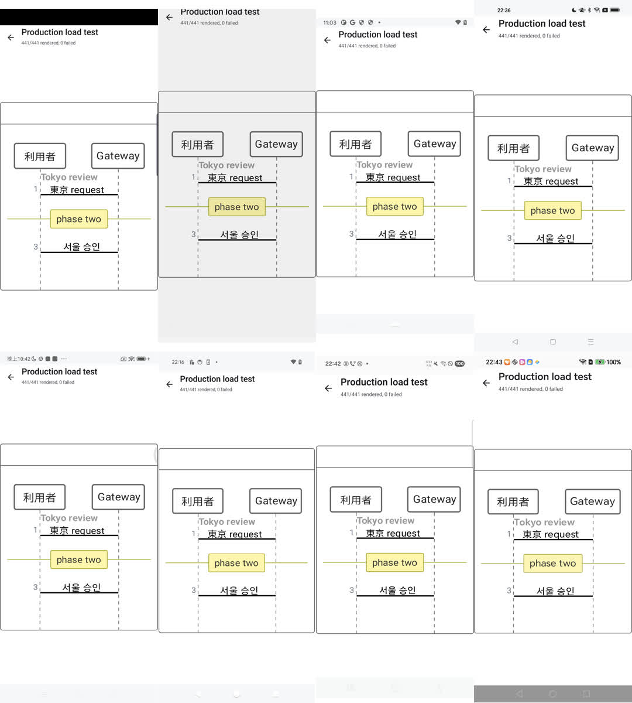
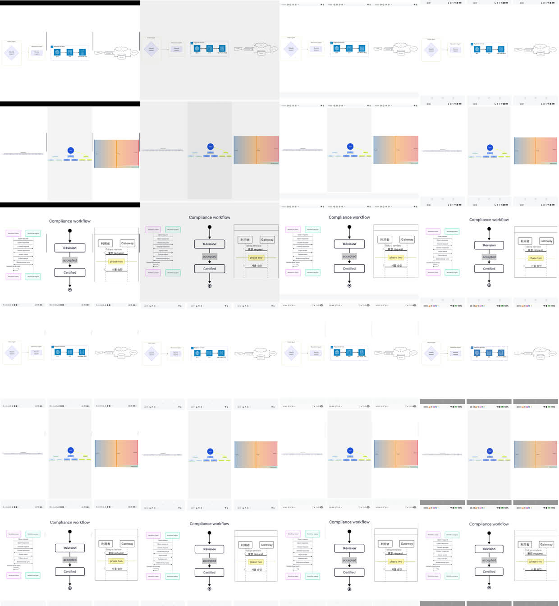
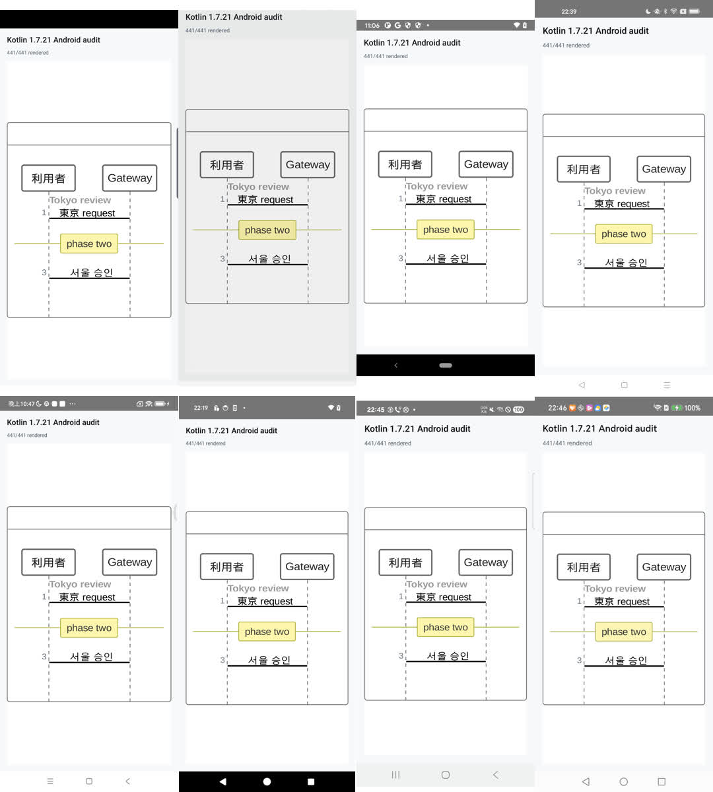
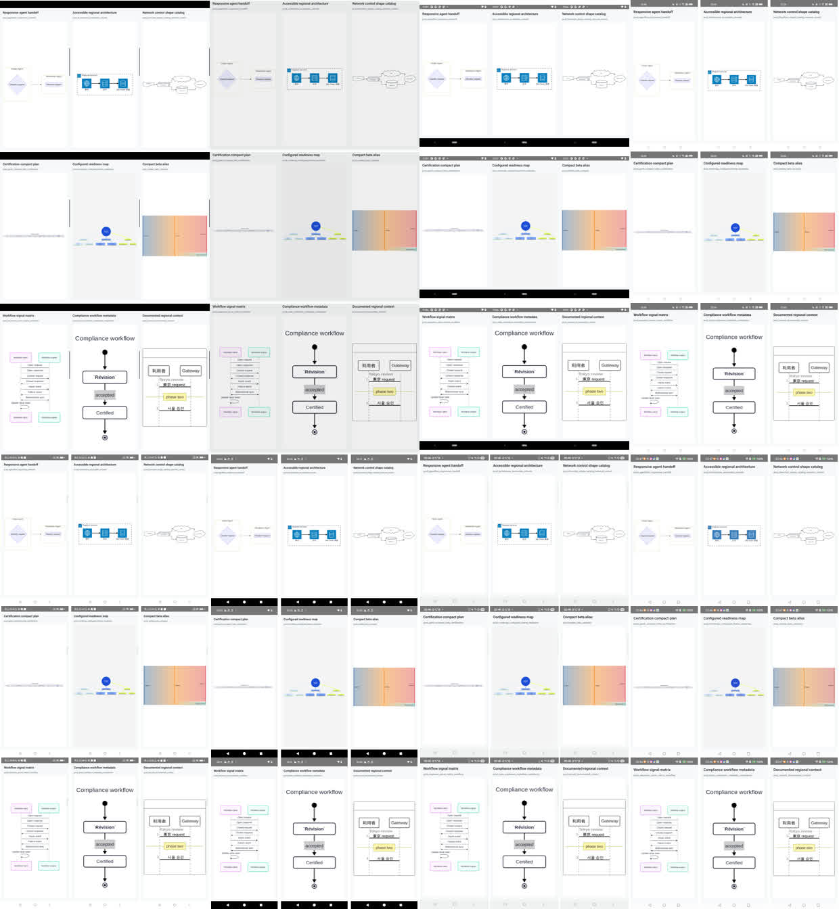

# Android Physical-Device Compatibility Report

> [!IMPORTANT]
> This report covers the post-fix source candidate tested on September 27,
> 2026. It does not retroactively certify binaries published before that date.

## Result

The same eight-device matrix was run independently with the current Kotlin
`2.3.20` Android sample and the isolated Kotlin `1.7.21` Android artifact.

| Track | Devices | Corpus renders | Reviewed sentinel screenshots | Crashes | ANRs | Result |
| --- | ---: | ---: | ---: | ---: | ---: | :---: |
| Kotlin `2.3.20` | 8 | 3,528 | 72 | 0 | 0 | **8/8 passed** |
| Kotlin `1.7.21` | 8 | 3,528 | 72 | 0 | 0 | **8/8 passed** |
| Combined | 16 device-build runs | 7,056 | 144 | 0 | 0 | **16/16 passed** |

Every run rendered all 441 production-corpus cases sequentially. A case
advanced only after `GMResult.Ok` or `GMResult.Err`; any error emitted a
failure marker. All 16 runs reached the final case with zero failures and with
the process still alive.

## Device Matrix

| # | Manufacturer and model | Android | API | Display | Density | Kotlin 2.3.20 load / peak PSS | Kotlin 1.7.21 load / peak PSS |
| ---: | --- | ---: | ---: | --- | ---: | --- | --- |
| 1 | Samsung SM-G973U | 9 | 28 | 1440 x 3040 | 420 dpi | 74s / 448,286 KiB | 77s / 347,209 KiB |
| 2 | Google Pixel 4 | 10 | 29 | 1080 x 2280 | 440 dpi | 70s / 361,701 KiB | 72s / 281,217 KiB |
| 3 | Google Pixel 3 | 11 | 30 | 1080 x 2160 | 440 dpi | 78s / 470,521 KiB | 76s / 411,887 KiB |
| 4 | OnePlus IN2010 | 12 | 31 | 1080 x 2400 | 480 dpi | 71s / 293,331 KiB | 76s / 221,924 KiB |
| 5 | Redmi K60 Pro / 22127RK46C | 13 | 33 | 1440 x 3200 | 560 dpi | 53s / 385,967 KiB | 52s / 311,088 KiB |
| 6 | Google Pixel 9 | 14 | 34 | 1080 x 2424 | 420 dpi | 73s / 412,330 KiB | 74s / 333,495 KiB |
| 7 | Samsung SM-S9210 | 15 | 35 | 1080 x 2340 | 480 dpi | 61s / 372,158 KiB | 61s / 306,026 KiB |
| 8 | Honor PTP-AN00 | 16 | 36 | 1264 x 2800 | 560 dpi | 64s / 324,114 KiB | 65s / 288,093 KiB |

The matrix spans five manufacturers, Android 9-16, API 28-31 and 33-36,
420-560 dpi, phones, and a foldable outer display. All devices used the ARM64
ABI and default system font scale. PSS is diagnostic across dissimilar devices
and is not a normalized performance benchmark.

## Strict Gates

A device-build run passed only when:

- the serialized load test reached `441/441 rendered, 0 failed`, or the
  equivalent Kotlin 1.7 completion marker with no failure marker;
- the application process remained alive;
- the Android crash buffer contained no fatal exception or native fatal
  signal;
- the Android event buffer contained no package-specific ANR;
- the completion screenshot passed size and nonblank-pixel checks; and
- all nine visual sentinels exposed `cmp-mermaid-audit:ready:` before capture.

The nine sentinels cover Flowchart, Sequence, State, Gantt, Mindmap, Sankey,
Agentflow, Architecture, and ZenUML. Manual review checked nodes, edges,
markers, labels, Unicode, ordering, blank output, clipping, overlap, paint
loss, and density-dependent scaling.

## Visual Evidence

Images are ordered by Android version from 9 through 16.

### Kotlin 2.3.20





### Kotlin 1.7.21





No unresolved semantic or structural rendering difference was found between
the two compiler tracks. Visible variation was limited to system chrome, OEM
font rendering, and density-dependent scaling.

## Defect Found And Fixed

The earlier exploratory matrix found an Android ICU incompatibility in an
Agentflow metadata-whitespace regular expression. Mermaid.js accepts the
upstream expression `/}[^\S\n]*\n/g`, while Android ICU rejects the unescaped
closing brace used by a direct Kotlin `Regex` translation.

The Kotlin expression now escapes the literal closing brace:

```kotlin
Regex("""\}[^\S\n]*\n""")
```

Focused regression tests cover blank-line source positions and trailing
horizontal whitespace. Both complete matrices in this report use the corrected
source.

## Scope Limits

- Android 7 and 8 physical devices were unavailable, so this report does not
  claim physical-device coverage for API 24-27.
- API 32, tablets, landscape, split-screen, freeform windows, accessibility
  font scaling, fold transitions, and unfolded inner displays were not part of
  the final strict matrix.
- Screenshots validate selected rendered states, not gestures, links, or host
  application lifecycle integration.
- The matrix checks Native Android output against reviewed expected output and
  the separately published Native/Official evidence. It does not run the
  Official browser renderer on every device.

## Reproduction

Run the current Android sample against an authorized ADB device:

```bash
ANDROID_SERIAL=<adb-serial> \
APK_PATH=sample/androidApp/build/outputs/apk/debug/androidApp-debug.apk \
OUTPUT_DIR=captures/local/android-kotlin2 \
tools/runtime-audit/android-device-compatibility-test.sh
```

Run the isolated Kotlin `1.7.21` audit host:

```bash
ANDROID_SERIAL=<adb-serial> \
APK_PATH=android-legacy-build/device-audit/build/outputs/apk/debug/device-audit-debug.apk \
PACKAGE_NAME=com.swithun.cmpmermaid.legacyaudit \
ACTIVITY_NAME=com.swithun.cmpmermaid.legacyaudit.LegacyMermaidAuditActivity \
OUTPUT_DIR=captures/local/android-kotlin17 \
tools/runtime-audit/android-device-compatibility-test.sh
```

The tested APK SHA-256 values were:

```text
Kotlin 2.3.20: ed19424d2e095fd7c21a0b3a546802dea871bf2ccd335378259f4f8fa10b158e
Kotlin 1.7.21: 5ef6c2dc744899b2dd420922f302fe4dcb4202942f99900f1bf00a1948854ee3
```

Raw execution metadata remains local. This public report contains only generic
device characteristics, aggregate results, and reviewed screenshots.
