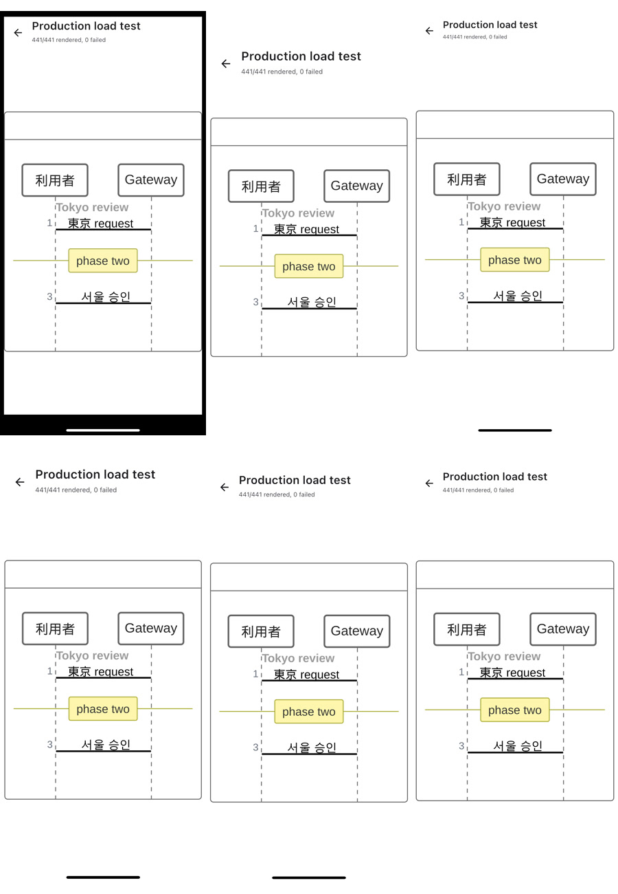
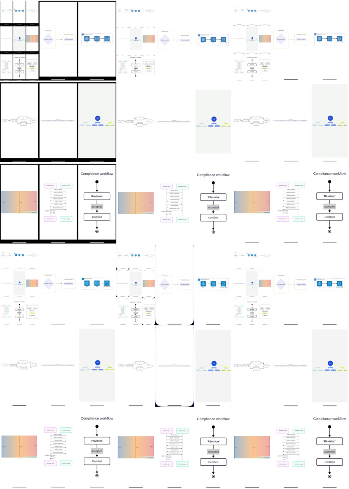

# iOS Physical-Device Compatibility Report

> [!IMPORTANT]
> This report covers the source candidate tested on September 27, 2026. It does
> not retroactively certify binaries published before that date.

## Result

| Item | Result |
| --- | --- |
| Physical devices | 6 |
| iOS versions | 14.3, 15.2, 16.3.1, 17.4.1, 18.4.1, and 26.0 |
| Production-corpus renders | 2,646: 441 cases on every device |
| Reviewed sentinel screenshots | 54 |
| Completion screenshots | 6 |
| New crash reports or process exits | 0 |
| Blank or invalid screenshots | 0 |
| Unresolved visual defects | 0 |
| Final device result | **6/6 passed** |

Every device ran the same ARM64 IPA. Each load test rendered exactly one
corpus case at a time and advanced only after `GMResult.Ok` or `GMResult.Err`.
All six devices reached `441/441 rendered, 0 failed` with the process still
running.

## Device Matrix

| # | Device | iOS | Physical display | 441-case load | Device memory before / after |
| ---: | --- | ---: | --- | ---: | --- |
| 1 | iPhone 11 | 14.3 | 828 x 1792 | 76s | 2,769 / 2,890 MiB used |
| 2 | iPhone SE (2nd generation) | 15.2 | 750 x 1334 | 67s | 2,129 / 2,279 MiB used |
| 3 | iPhone 12 Pro Max | 16.3.1 | 1284 x 2778 | 62s | 2,689 / 2,919 MiB used |
| 4 | iPhone 11 Pro | 17.4.1 | 1125 x 2436 | 66s | 2,406 / 2,608 MiB used |
| 5 | iPhone 16 Pro | 18.4.1 | 1206 x 2622 | 57s | 3,276 / 3,510 MiB used |
| 6 | iPhone 14 Pro Max | 26.0 | 1290 x 2796 | 123s | 3,208 / 3,398 MiB used |

The memory figures are device-wide snapshots exposed by the device tooling.
They are retained as diagnostics only and must not be interpreted as
process-level RSS or as a cross-device performance benchmark.

## Strict Gates

A device run passed only when:

- the UI exposed `441/441 rendered, 0 failed`;
- the application process remained in the running state;
- the post-run crash-report list contained no new entry;
- the completion screenshot was nonempty; and
- all nine visual sentinels exposed `cmp-mermaid-audit:ready:` before capture.

The sentinels cover Flowchart, Sequence, State, Gantt, Mindmap, Sankey,
Agentflow, Architecture, and ZenUML. Manual review checked nodes, edges,
markers, labels, Unicode, ordering, blank output, clipping, overlap, paint
loss, safe areas, and scaling on both compact and large displays.

## Visual Evidence

Images are ordered by iOS version from 14.3 through 26.0.





No unresolved semantic or structural rendering difference was found. The
wide Gantt sentinel is intentionally scaled down to preserve the complete time
axis on a portrait display.

## Scope Limits

- The matrix covers portrait orientation and default text size.
- Landscape, Split View, external displays, Dynamic Type changes, and
  background/foreground lifecycle stress were not exercised.
- Screenshots validate selected rendered states, not gestures, links, or host
  application lifecycle integration.
- The matrix checks Native iOS output against reviewed expected output and the
  separately published Native/Official evidence. It does not run the Official
  browser renderer on every device.
- Memory data is device-wide because process-level memory was not exposed by
  the test transport.

## Tested Artifact

The tested IPA contains an ARM64 device binary with an iOS 14.0 deployment
target. Its SHA-256 was:

```text
c2ed79e310423061c6cc2836185f24cec56724d2886a352e325a2fa1150d019d
```

Raw execution metadata remains local. This public report contains only generic
device characteristics, aggregate results, and reviewed screenshots.
